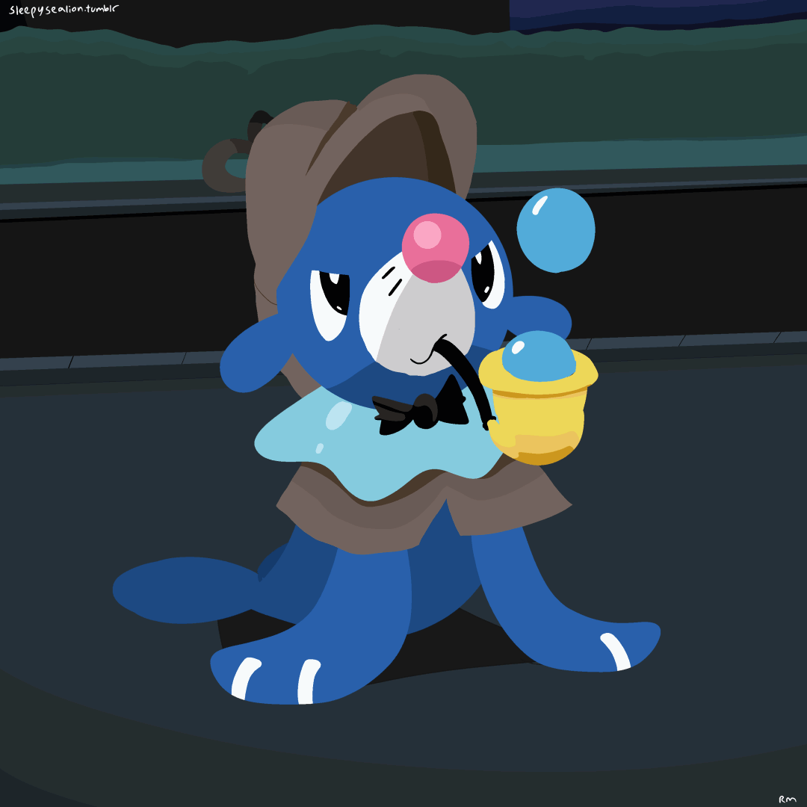

# SpiderMath

  

(^ ^) My GitHub4Life

## 🗣️ Description
α. Languages spoken:  

- English
- Bengali
- Hindi
- French (Too basic)

β. Known programming languages:  

- JavaScript
- Python
- C/C++
- Bash

γ. Primary IDEs:

- Visual Studio Code 
- Neovim 
- Atom 

δ. Favourite topics:

- Maths
- Physics
- Hindu Mythology
- Chemistry
- Genetics
- History
- Geography
- Political Science

## 🫂 Socials

### 📺 YouTube Videos
<!-- YOUTUBE:START -->
<!-- YOUTUBE:END -->

### ⚡ Recent Activity
<!--START_SECTION:activity-->
<!--END_SECTION:activity-->

### 🎲 Random Programming Quote:
<!--PROGRAMMING-QUOTE-BOT:start-->
<<<<<<< HEAD
=======
<blockquote> <h5> <i> The real problem with throwaway code comes when it isn't thrown away. </i> </h5>
<h5> - <b>Joseph Yoder (computer scientist)</b> </h5> </blockquote>
 
>>>>>>> 48c655b776d1df14665122b736f923d1615209f1
<!--PROGRAMMING-QUOTE-BOT:end-->
